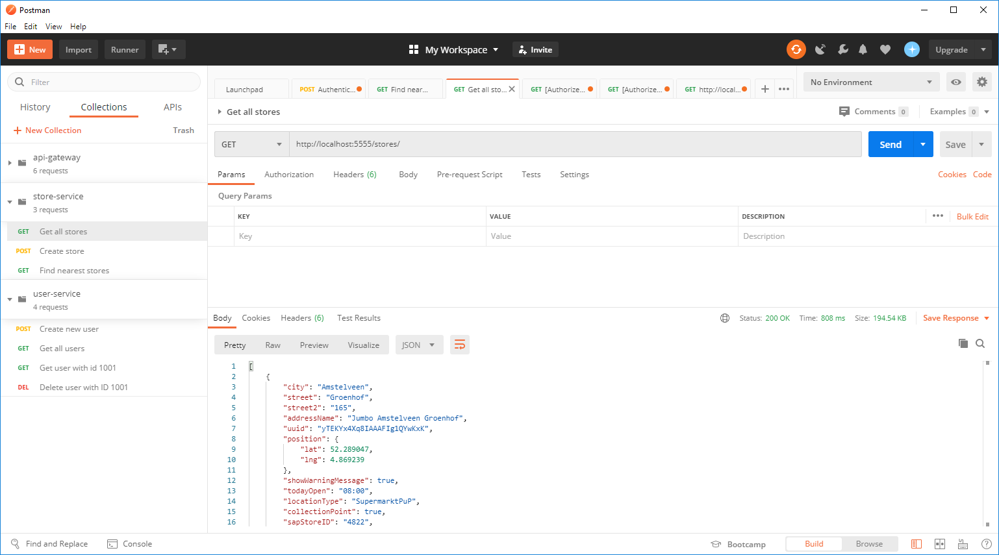

  

# Jumbo Store Locator

A private repository for Jumbo coding assessment: Create an application that shows the 5 closest Jumbo stores to a given position.
Powered by Spring Boot + Vue.js.

TODO: improve the readme as the project starts to take shape, adding missing microservices, tech stacks and any other relevant information.

## Index :pushpin:
- [Design](#design)
- [Architecture](#about)
- [How to run](#run)
- [Testing](#testing)
- [Future enhancements](#future)

## Design  :memo:

Before discussing the architecture of a system, one must first understand what it is going to be built. When presented with a requirement which only states the general purpose of an application without exploring the intricate details and complementing functionalities, it makes sense to first explore how it is currently solved and then evalute what improvements can be made, if any.

#### State of the art

When designing a new feature, it makes sense to understand what is already in place, both in your business and elsewhere. For Jumbo, such feature is already available, as seen here: https://www.jumbo.com/winkels (powered by google maps). Upon loading, it displays all existing stores and allows several different filters:  _`Open now`_, _`Open on Sundays"`_, _`Open until 19/20/21/22`_, _`New store`_, _`Pickup-point`_, _`Store`_, and _`Store + pickup-point`_.

It has a wide range of filters, but it lacks what is being asked here: to display only the 5 nearest stores. Therefore, it makes sense to implement that filter in a way that is easy to incorporate it among the others. From what I've observed, stores are already ordered by distance on the existing page.

On the details of each found store, the page also allows the user to navigate to 2 other pages:
- [Store details](https://www.jumbo.com/winkel/jumbo-heinkenszand-stenevate)
- [Reserve pick-up time](https://www.jumbo.com/INTERSHOP/web/WFS/Jumbo-Grocery-Site/nl_NL/-/EUR/ViewDeliveryOptions-Start?storeUUID=8E0KYx4XCQQAAAFoMTtWMVlg)

The store information I can work with is provided in a json format, and contains the following fields: _`city`_, _`postalCode`_, _`street`_, _`street2`_, _`street3`_, _`addressName`_, _`uuid`_, _`longitude`_, _`latitude`_, _`complexNumber`_, _`showWarningMessage`_, _`todayOpen`_, _`locationType`_, _`collectionPoint`_, _`sapStoreID`_ and _`todayClose`_. 

It seems to have most of the fields necessary to replicate a similar list to the one provided at Jumbo's website, except by the open/close times on other days of the week. The _`uuid`_ field would also allow the _`reserve pick-up time`_ button to be implemented. However, the data needed for the store details button does not seem to be available. 

I also compared Jumbo's store finder with Walmart's. The UI is very similar, having a search-box within the map that displays an expandable list of stores, the main difference being that Walmart's does not have such a wide range of filters and does not display any store until the user provides a location (probably due to the amount of stores).

#### Proposed design

In terms of functionality, the original system offers much more than the scope of this project. The filters are very specific and seem to convey that it was something that was built over time, by listening to customer feedback. It also makes sense to have the search bar within the map, as mobile users do not have much screen real-state and need to have a compact and responsive UI. Therefore, a simpler but functional version of the existing Jumbo store finder will be created in this small project.

  

The supported features at the present version are:
- TODO: add feature #1
- TODO: add feature #2
- TODO: add feature #3

## Architecture  :scroll:

This project was developed using _`Spring Boot (2.3.2.RELEASE)`_ for the back-end microservices and _`Vue.js 2.6.11`_ for the front-end components. The back-end modules were implemented with a microservice architecture in mind.

The solution is divided into the _`frontend`_ project for the user interface and several microservices for the back-end:
- _`finder-client`_: Vue.js project with a _`login`_ form and _`find store`_ page. Communicates directly with the _`api-gateway`_.
- _`discovery-service`_: eureka discovery service that all other services subscribe to.
- _`api-gateway`_: deals with token validation and redirects requests to other microservices.
- _`auth-service`_: validates user credentials and issue tokens.
- _`user-service`_: customer entity/controller/service/etc with a simple in-memory h2 database, used in conjunction with auth-service.
- _`store-service`_: store entity/controller/service/etc with mongodb (atlas), returns N closest stores to a given location.
- _`config-service`_: centralized configuration service that store properties used by other microservices.

It is important to note that, in a production environment, each of these projects would be located in separate repositories, allowing teams to work on modules independently and isolating all the moving parts of the product's architecture. However, they were kept together for this project to make it easier for a reviewer to analyze everything that was done on this small project.

Why have microservices for such a small application? Creating small, independent microservices allow us to integrate/replace/maintain functionality in a bigger project with minimal effort. In this particular case, what is really being asked is that a store locator API is implemented, but as I have no access to Jumbo's API Gateway, front-end, user/customer service, etc, it makes sense to create my own and keep them separate, simply acting as placeholders for an MVP demonstration.

Several libraries were used to fulfill the needed business logics; the main ones are listed below:

#### Netflix Zuul

- _`Spring Zuul`_ is employed as an _`API Gateway`_. It uses Eureka to discover microservices' instances and redirects requests accordingly.
- _`JWT tokens`_ are validated by this module, preventing that requests delve much deeper into the architecture if not necessary. 
- _`Authorization`_ rules are put in place to prevent non-admins from accessing restriced APIs. Guest users are restricted even further.

#### Netflix Eureka

- _`Service Discovery`_ is performed by _`Netflix Eureka`_. This allows microservices to communicate with one-another through Feign Client (which has not yet been used on this project, as RabbitMQ was employed instead). 
- Even if _`Feign Client`_ is not used, it is useful to enable load balancing on Zuul. The latter is still not applied, as the application was only tested locally with dev settings; however, it is important to leave such things in place when the need to setup a production environment with multiple instances arises.

#### RabbitMQ

- _`RabbitMQ`_ is is usually employed for asynchronous message exchange between microservices. However, in this project, is it used to establish synchronous RPC communication between _`user-service`_ and _`auth-service`_.\
- Using message-based RPC, services have no direct dependencies on other services; a service only depends on a response to a message request it makes to that queue. What it does is send a string to a queue (the start of asynchronous communication) and waiting for a message in a different queue to send it back as an HTTP response.
- Generally speaking, it would be better to employ CQRS + event sourcing. This way, user-service would issue events whenever a user is registered/altered/deleted, and auth-service would capture these events and store a relation of user emails/passwords/roles. However, this is a fairly small application, and it seemed overkill to implement such pattern.

#### Spring Cloud Config

- _`Spring Cloud Config`_ implements the third factor in the Twelve-Factor App Methodology, which ensures separation between code and configuration.
- As there is little concern about dev/prod environments on this project, only a single profile was set (default). Not much was done also in terms of security (encryption/authentication) for the stored properties, which is mandatory in a productioin environment.

#### Google Maps API

- _`Google maps API`_ is used to retrieve the 5 closes stores based on a given location, as well as displaying said stores on an embedded map on the _`frontend`_ project.

#### Netflix Hystrix

- _`Netflix Hystrix`_ is used to implement the _`Circuit Breaker`_ design pattern, that is, if a microservice is unavailable, a _`fallback`_ method is called to prevent a systematic failure.
- In this particular project, it is used to provide a guest user as a fall-back, in case _`user-service`_ is unavailable.

#### Sleuth

- _`Sleuth`_ is a logging solution that allows tracing actions across multiple services through unique trace IDs (done automatically), which makes it a perfect solution for a microservice architecture. 
- Logs can be visualized in a dashboard through [zipkin](https://zipkin.io/), if so desired.

## How to run  :wrench:

In order to run this project locally, make sure you have:
- [Java 8 SDK](https://www.oracle.com/br/java/technologies/javase/javase-jdk8-downloads.html) installed and properly configured on JAVA_HOME.
- [RabbitMQ](https://www.rabbitmq.com/download.html) and [Erlang](https://www.rabbitmq.com/which-erlang.html).
- [Maven](http://maven.apache.org/download.cgi) installed and properly configured on your PATH variable.
- [npm](https://www.npmjs.com/get-npm) for the Vue.js front-end application.

Having downloaded the project and installed all the needed libraries, you have to do the following in separate terminals:
- Get _`RabbitMQ`_ up and running by executing _`rabbitmq-server`_ on the installation folder.
- On _`finder-client`_ folder, run _`npm install`_  to intall all the dependencies, and execute _`run serve`_ to start the Vue.js application.
- On _`discovery-service`_ folder, execute _`java -jar discovery-service`_.
- On _`config-service`_ folder, execute _`java -jar config-service`_.
- On _`api-gateway`_ folder, execute _`java -jar api-gateway`_.
- On _`auth-service`_ folder, execute _`java -jar auth-service`_.
- On _`user-service`_ folder, execute _`java -jar user-service`_.
- On _`store-service`_ folder, execute _`java -jar store-service`_.

Having it all up and running, you can [run and test](#manual) the application by typing http://localhost:8081 on your favorite browser.

TODO: double-check run instructions when project is done.

## Testing  :beetle:

This project was tested in three ways:
- Controllers, Services and Repositories were tested with JUnit.
- API calls were tested with [Postman](https://www.postman.com/).
- And last but not least, the UI was tested manually (TODO: add selenium for this project).

#### JUnit

_`JUnit`_ was used alongside _`Mockito`_ for the _`Services`_, _`Controllers`_ and _`Repositories`_ unit/integration tests. _`MockMvc`_ was used to test _`Controllers`_ response, while _`TestEntityManager`_ was used to simulate _`Repositories`_.

#### Postman

This tool facilitates API testing by allowing the creation of get/post/put/delete/etc requests collections, which helps back-end developers a lot when a frontend is not yet available.

  

TODO: When development is done, share the postman collections here.

#### Manual tests 

With the application [up and running](#run), head towards http://localhost:8081 on your favorite browser and you will be greeted with the store locator landing page.

TODO: Add screenshots and general instructions.

## Future enhancements  :clock130:

- Migrate the h2 database into another database. PostgreeSQL and MySQL are valid options in terms of SQL, while MongoDB and DynamoDB are appealing ones in terms of NoSQL.
- Add admin-specific pages for managing users and stores.
- Add security for _`Spring Cloud Config`_.
- Improve logging (ELK Stack).
- Add selenium tests (that is, don't rely on JUnit and Postman alone).
