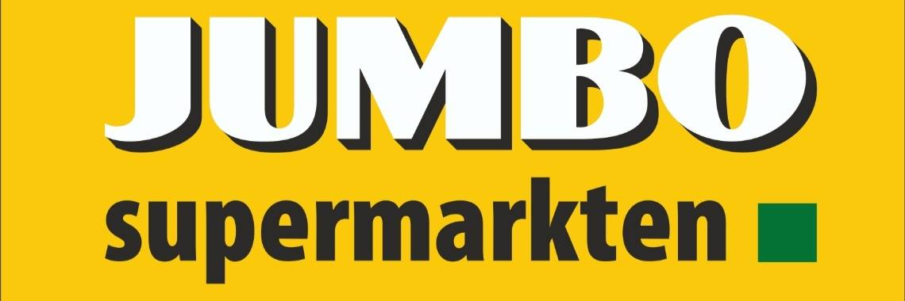

  

# Jumbo Store Locator

A private repository for Jumbo coding assessment: Create an application that shows the 5 closest Jumbo stores to a given position.
Powered by Spring Boot + Vue.js.

TODO: improve the readme as the project starts to take shape, adding missing microservices, tech stacks and any other relevant information.

## Index :pushpin:
- [Design](#design)
- [Architecture](#about)
- [How to run](#run)
- [Testing](#testing)
- [Future enhancements](#future)

## Design  :memo:

Before discussing the architecture of a system, one must first understand what it is going to be built. When presented with a requirement which only states the general purpose of an application without exploring the intricate details and complementing functionalities, it makes sense to first explore how it is currently solved and then evalute what improvements can be made, if any.

#### State of the art

When designing a new feature, it makes sense to understand what is already in place, both in your business and elsewhere. For Jumbo, such feature is already available, as seen here: https://www.jumbo.com/winkels (powered by google maps). Upon loading, it displays all existing stores and allows several different filters:  _`Open now`_, _`Open on Sundays"`_, _`Open until 19/20/21/22`_, _`New store`_, _`Pickup-point`_, _`Store`_, and _`Store + pickup-point`_, as well as `_store type`_ filters*.

*Note: Either I didn't understand how the `_store type`_ filter works, or there's a bug on it. When I filter by "Pick-up point", I still get stores like [Jumbo Den Burg (Texel) Vogelenzang](https://www.jumbo.com/winkel/jumbo-den-burg-texel-vogelenzang?redirect=true), which (as far as I can see) is not a pick-up point. 

On the details of each found store, the user is allowed the following actions:
- Favoriting at store.
- [Visualize store details](https://www.jumbo.com/winkel/jumbo-heinkenszand-stenevate).
- [Reserve pick-up time](https://www.jumbo.com/INTERSHOP/web/WFS/Jumbo-Grocery-Site/nl_NL/-/EUR/ViewDeliveryOptions-Start?storeUUID=8E0KYx4XCQQAAAFoMTtWMVlg) (if applicable).

The store information I can work with is provided in a json format, and contains the following fields: _`city`_, _`postalCode`_, _`street`_, _`street2`_, _`street3`_, _`addressName`_, _`uuid`_, _`longitude`_, _`latitude`_, _`complexNumber`_, _`showWarningMessage`_, _`todayOpen`_, _`locationType`_, _`collectionPoint`_, _`sapStoreID`_ and _`todayClose`_. 

It seems to have most of the fields necessary to replicate a similar list to the one provided at Jumbo's website, except by the open/close times on other days of the week. The _`uuid`_ field would also allow the _`reserve pick-up time`_ button to be implemented. The _`store details button`_ seems to require some logic to be applied, for example: when the same _`addressName`_ field is used twice (e.g. Jumbo Hulst Stationsplein *22H* and *30*), the _`street2`_ field is embedded on the url: https://www.jumbo.com/winkel/jumbo-hulst-stationsplein-30. This is problematic with the provided test data because *Jumbo Hulst Stationsplein 22H* is missing, so there is no good way to know if the `_street2_` field should be appended or not on the url.

I also compared Jumbo's store finder with the one provided by Walmart. The UI is very similar, having a search-box within the map that displays an expandable list of stores; the main difference being that Walmart's does not have such a wide range of filters and does not display any store until the user provides a location (probably due to the amount of stores). The UI also has different quirks in terms of how details of a shop are displayed.

#### Proposed design

In terms of functionality, the original system offers much more than the scope of this project. The filters are very specific and seem to convey that it was something that was built over time, by listening to customer feedback. As for the UI: it makes sense to have the search bar within the map, as mobile users do not have much screen real-state and need to have a compact and responsive UI. Therefore, a simpler but functional version of the existing Jumbo store finder was designed for this project.

  

Geneal premisses:
- Users are able to log-in through email/password or with a guest user, but for this MVP no registration page is provided (hardcoded users). 
- After logging in, the user is presented with a map centered at the Netherlands, displaying all available stores on a map. 
- The map displays a list of found stores (all by default), contains a search panel and allows filtering. 
- The search panel does not display any stores until the user makes his first query. 
- When the user clicks on a store on the panel, the map pans and zooms to the location, and the marker icon changes to help the user identify the selected store.
- When the user clicks on a marker, the search panel scrolls to the selected store to display its detailed information.
- Users are able to favorite a store.

The following filters are supported:
- All stores: query all stores, ordered by distance of the provided address.
- Closest stores: query the 5 nearest stores, ordered by distance of the provided address.
- Favorite stores*: query only the favorited stores, ordered by distance of the provided address.
- Store types: in combination to the selected filter, the user is able to specify which store types should be fetched: _`store`_, _`pick-up point`_ and `_drive-through of walk-in pick-up point`_.

*Note: the favorite store query is only enabled if the user is logged in; guest users can't favorite a store.

The "collapsed" details of a store displays the following info:
- Title: _`addressName`_.
- Line 1: _`street`_ +  _`street2`_.
- Line 2: _`city`_.
- Line 3: Open today: _`todayOpen`_ - _`todayClose`_.
- Side info: store type indicator (icon) with a link to pick-up reservation (if applicable)
- Side info: distance with a google maps link to display the route.

When expanded, additional info is displayed:
- Hardcoded open/close times (since we have no data for it)
- Warning about pick-up prices (if applicable)
- Side info: favorite/unfavorite the store (for non-guest users).

The "nearest stores" logic is managed by the back-end.

Disclaimer: several icons, styling and text were obtained from Jumbo's website and are not to be utilized outside of this private repository.

## Architecture  :scroll:

This project was developed using _`Spring Boot (2.3.2.RELEASE)`_ for the back-end microservices and _`Vue.js 2.6.11`_ for the front-end components. The back-end modules were implemented with a microservice architecture in mind.

The solution is divided into the _`frontend`_ project for the user interface and several microservices for the back-end:
- _`finder-client`_: Vue.js project with a _`login`_ form and _`find store`_ page. Communicates directly with the _`api-gateway`_.
- _`discovery-service`_: eureka discovery service that all other services subscribe to.
- _`api-gateway`_: deals with token validation and redirects requests to other microservices.
- _`auth-service`_: validates user credentials and issue tokens.
- _`user-service`_: customer entity/controller/service/etc with a simple in-memory h2 database, used in conjunction with auth-service.
- _`store-service`_: store entity/controller/service/etc with mongodb (atlas), returns N closest stores (by type) to a given location.
- _`config-service`_: centralized configuration service that store properties used by other microservices.

  

It is important to note that, in a production environment, each of these projects would be located in separate repositories, allowing teams to work on modules independently and isolating all the moving parts of the product's architecture. However, they were kept together for this project to make it easier for a reviewer to analyze everything that was done on this small project.

Why have microservices for such a small application? Creating small, independent microservices allow us to integrate/replace/maintain functionality in a bigger project with minimal effort. In this particular case, what is really being asked is that a store locator API is implemented, but as I have no access to Jumbo's API Gateway, front-end, user/customer service, etc, it makes sense to create my own and keep them separate, simply acting as placeholders for an MVP demonstration.

Several libraries were used to fulfill the needed business logics; the main ones are listed below:

#### Netflix Zuul

- _`Spring Zuul`_ is employed as an _`API Gateway`_. It uses Eureka to discover microservices' instances and redirects requests accordingly.
- _`JWT tokens`_ are validated by this module, preventing that requests delve much deeper into the architecture if not necessary. 
- _`Authorization`_ rules are put in place to prevent non-admins from accessing restriced APIs. Guest users are restricted even further.

#### Netflix Eureka

- _`Service Discovery`_ is performed by _`Netflix Eureka`_. This allows microservices to communicate with one-another through Feign Client (which has not yet been used on this project, as RabbitMQ was employed instead). 
- Even if _`Feign Client`_ is not used, it is useful to enable load balancing on Zuul. The latter is still not applied, as the application was only tested locally with dev settings; however, it is important to leave such things in place when the need to setup a production environment with multiple instances arises. Why not outright removing it for now, then? Because as any project that is worth something, you *have* to think of an eventual production environment when things are ready to ship, and having it already setup is a good thing.

#### H2 Database Engine

- _`H2`_ was employed as the SQL database for the _`user-service`_ to store login information and on the _`config-service`_ to store application properties.
- Although it has little place in production envrionments, it is a great tool to present an MVP as it is very easy to migrate to another solution (e.g. MySQL).

#### MongoDB Atlas

- _`MongoDB`_ is a NoSQL database that is very suitable for restful applications, as data is already store in a json format. _`MongoDB Atlas`_ is a cloud solution that hosts _`MongoDB`_ databases, being not only suitable for quickly testing an application (little to no setup time involved) and escalating well for production environments.
- In this particular application, _`MongoDB`_ is used by _`store-service`_ to hold the store data. 
- While google maps platform documentation presents a very fitting [SQL solution](https://developers.google.com/maps/solutions/store-locator/clothing-store-locator) to query the distance between an address and the stored locations, it is also feasible to implement the same functionality with [GeoJSON](https://geojson.org/). Why use one over the other? Mainly because NoSQL is a good fit for the needs of our _`store-service`_.

#### RabbitMQ

- _`RabbitMQ`_ is is usually employed for asynchronous message exchange between microservices. However, in this project, is it used to establish synchronous RPC communication between _`user-service`_ and _`auth-service`_.
- Using message-based RPC, services have no direct dependencies on other services; a service only depends on a response to a message request it makes to that queue. What it does is send a string to a queue (the start of asynchronous communication) and waiting for a message in a different queue to send it back as an HTTP response.
- Generally speaking, it would be better to employ CQRS + event sourcing. This way, user-service would issue events whenever a user is registered/altered/deleted, and auth-service would capture these events and store a relation of user emails/passwords/roles. However, this is a fairly small application, and it seemed overkill to implement such pattern.

#### Spring Cloud Config

- _`Spring Cloud Config`_ implements the third factor in the Twelve-Factor App Methodology, which ensures separation between code and configuration.
- As there is little concern about dev/prod environments on this project, only a single profile was set (default). Not much was done also in terms of security (encryption/authentication) for the stored properties, which is mandatory in a productioin environment.

#### Google Maps API

- _`Maps JavaScript API`_ enables the use of google maps on an html/javascript front-end.
- _`Geocoding API`_ is used to convert addresses (e.g. Netherlands) into geographic coordinates.
- _`Places API`_ helps with address auto-complete.

#### Sleuth

- _`Sleuth`_ is a logging solution that allows tracing actions across multiple services through unique trace IDs (done automatically), which makes it a perfect solution for a microservice architecture. 
- Logs can be visualized in a dashboard through [zipkin](https://zipkin.io/), if so desired.

#### Libraries/Design patterns that were considered initially, but dropped

I initially planned to employ _`Netflix Hystrix`_ to implement _`Circuit Breaker`_ design pattern, that is, if a microservice is unavailable, a _`fallback`_ method is called to prevent a systematic failure. My first idea was to do that within _`auth-serive`_, but automatically logging the user in as a guest if _`user-service`_ is down and unble to provide user info. However, it feels a bit cluncky from the user perspective, so I decided against it in the end. 

I also wanted to have _`store-service`_ only deal with CRUDE operations, having a dedicated microservice to perform search operations/favoriting to better separate concerns. However, not having event-sourcing implemeted would lead to tight coupling between the services and make it a little pointless at this stage in the project, adding more latency and complexity with very little gain. With that in mind, when/if _`RabbitMQ`_ is employed to notify other services of changes, it will make sense to separate these services.

## How to run  :wrench:

In order to run this project locally, make sure you have:
- [Java 8 SDK](https://www.oracle.com/br/java/technologies/javase/javase-jdk8-downloads.html) installed and properly configured on JAVA_HOME.
- [RabbitMQ](https://www.rabbitmq.com/download.html) and [Erlang](https://www.rabbitmq.com/which-erlang.html).
- [Maven](http://maven.apache.org/download.cgi) installed and properly configured on your PATH variable.
- [npm](https://www.npmjs.com/get-npm) for the Vue.js front-end application.

Having downloaded the project and installed all the needed libraries, you have to do the following in separate terminals:
- Get _`RabbitMQ`_ up and running by executing _`rabbitmq-server`_ on the installation folder.
- On _`config-service`_ folder, execute _`java -jar config-service`_.
- On _`discovery-service`_ folder, execute _`java -jar discovery-service`_.
- On _`api-gateway`_ folder, execute _`java -jar api-gateway`_.
- On _`auth-service`_ folder, execute _`java -jar auth-service`_.
- On _`user-service`_ folder, execute _`java -jar user-service`_.
- On _`store-service`_ folder, execute _`java -jar store-service`_.
- On _`finder-client`_ folder, run _`npm install`_  to intall all the dependencies, and execute _`run serve`_ to start the Vue.js application.

It is important that _`config-service`_ is the first to be initialized; the remainder of the projects can be initialized at any order. Having it all up and running, you can [run and test](#manual) the application by typing http://localhost:8081 on your favorite browser and either login as a guest or login with one of the following users:

- andre.janino@gmail.com / Password1
- marijn.deromph@jumbo.com / Password1
- tamara.duric@jumbo.com / Password1
- gustavo.henriquesmartins@jumbo.com / Password1

## Testing  :beetle:

This project was tested in three ways:
- Controllers, Services and Repositories were tested with JUnit.
- API calls were tested with [Postman](https://www.postman.com/).
- And last but not least, the UI was tested manually (TODO: add selenium for this project).

#### JUnit

_`JUnit`_ was used alongside _`Mockito`_ for the _`Services`_, _`Controllers`_ and _`Repositories`_ unit/integration tests. _`MockMvc`_ was used to test _`Controllers`_ response, while _`TestEntityManager`_ was used to simulate _`Repositories`_.

#### Postman

This tool facilitates API testing by allowing the creation of get/post/put/delete/etc requests collections, which helps back-end developers a lot when a frontend is not yet available.

  

#### Manual tests 

With the application [up and running](#run), head towards http://localhost:8081 on your favorite browser and you will be greeted with the store locator landing page.

TODO: Add screenshots and general instructions.

## Future enhancements  :clock130:

- Migrate the h2 database into another database for _`user-service`_. PostgreeSQL and MySQL are valid options in terms of SQL.
- Add admin-specific pages for managing users and stores. When this is done, also implement _`event-sourcing`_ to synchronize services which rely on this data (eliminate querying across services as much as possible).
- With the previous point implemented, separate the "favorite stores" functionality into its own microservice and refactor auth-service to have its own user db.
- Add security for _`Spring Cloud Config`_ and move the config to a github repo (JDBC-based Spring Cloud Config is interesting, but harder to configure).
- Improve logging (ELK Stack).
- Add selenium tests (that is, don't rely on JUnit and Postman alone).
